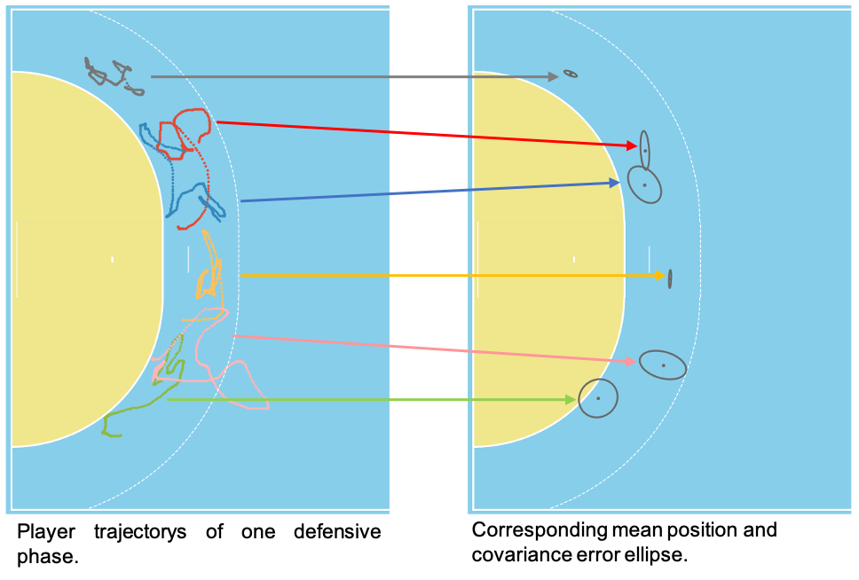
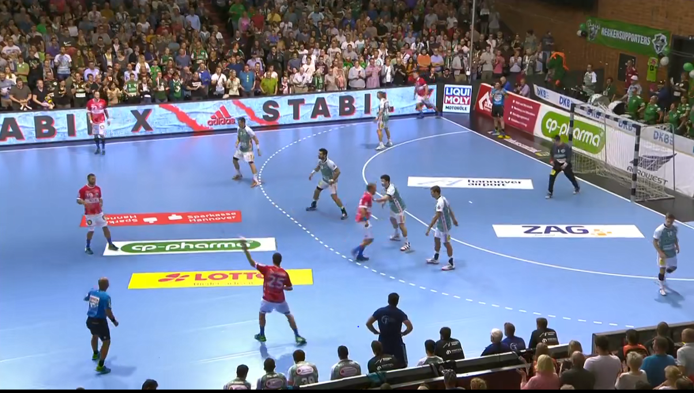
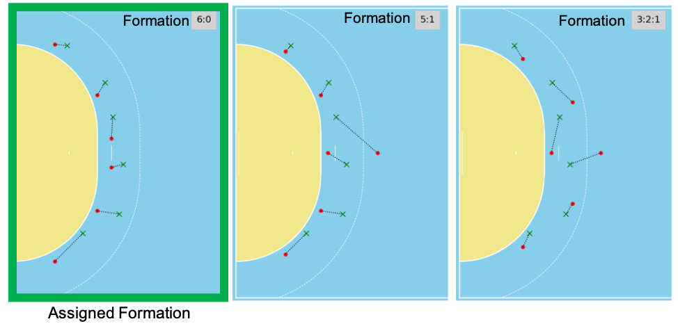

Automated handball formation recognition is a key aspect of tactical game analysis based on big data. The following described method offers for the first time the possibility to quantitatively evaluate tactical, sport-specific expert knowledge and to derive evidence-based performance indicators.
Tactical considerations arise from sport-specific expert knowledge, but so far there have been no scientific studies that have systematically evaluated them in handball. Positional data, which have been systematically collected for several years, now make it possible to investigate these issues quantitatively. Due to the cooperation with <a href="https://kinexon.com/" style="color:black"><i>KINEXON</i></a>, a large data set with position and video data was available. 
In order to be able to investigate differences between different formations, a method was developed to detect and distinguish defensive formations. For each player of the defending team, the mean position over a game scene was calculated.
{: .mx-auto.d-block :}
On the following picture you can see a video excerpt belonging to the graphic above.
{: .mx-auto.d-block :}

Using a template-matching approach  (<a href="https://dl.acm.org/doi/10.1145/3347318.3355527" style="color:black"><i>Müller-Budack et al., 2019</i></a>), the actual mean positions of the players were compared to idealized templates of the three defensive formations (6:0, 5:1, 3:2:1). In this approach, each player is assigned a role so that the distances between the actual positions and their ideal representation in the template are minimized. The similarity to a formation can then be calculated using the sum of the distances between the actual positions and the assigned roles. The most similar formation is selected as the predicted formation. 

{: .mx-auto.d-block :}
Template matching of the idealized positions (red dots) and the mean positions (green crosses) for each player in a defensive phase. The dashed lines show the role assignment when solving the linear assignment problem by minimizing the total distance of all players to the idealized positions.

