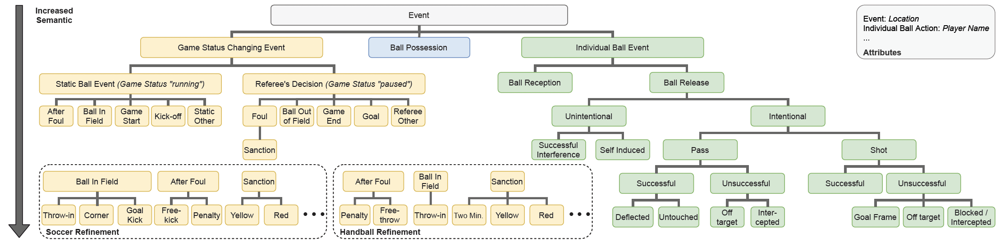

Events like passes or shots play an important role for the interpretation of complex invasion games like soccer, handball, hockey, or basketball. Over the last years, three fundamental perspectives emerged with regard to the analysis of sports games, which all value different characteristics of the respective sports.
Somewhat overstated: 
1. The **Machine Learning** (ML) perspective aims to find automatic solutions for specific tasks. This perspective is initially only interested in maximizing the model's performance regardless of what the output or error mean in terms of content. 
2. The **sports science** domain demands on semantically precise descriptions of the individual developments to analyze success factors. In contrast to the ML perspective, the sports science perspective is very interested in the events that were not recognized by the model and it will try to characterize the missing percentage to find similarities that are important for the description of the sport. 
3. Finally, the **practitioners** who do not care about the recognition of events alone but they would rather like to evaluate their impact. They are interested in, e.g., the immediate impact of specific modification of training or tactics. 

While the general objective to understand and exploit the underlying concepts in the sports is common to all perspectives, synergistic effects are barely observed. 
Prior work already presented automatic methods for the detection of individual sport-specific events with focus on soccer. However, collecting semantic and (spatio-) temporal properties for events during matches is non-trivial, highly dependent on the underlying definitions, and is, in the case of (accurate) manual annotations, very time-consuming and expensive. 
Due to ambigious definitions of the events and the fact that public datasets are very rare, both manual annotations and automatic detection of events do not fulfill a gold standard in annotation quality. 
Even though the sports science perspective offers some taxonomies there is no global annotation scheme or event taxonomy that covers various fine-grained events that can be evaluated with few meaningful metrics.

In our [paper](https://arxiv.org/pdf/2108.11149.pdf), we propose a taxonomy of base events that is valid for invasion games in general and can be refined or extended to sport-specific events. 

This taxonomy enables a game to be described more completly than has been done in the literature to date.
Starting with shared motoric tasks such as *ball release*, the complexity of events increases as well as the uncertainty in human annotations just in further differentiating *passes* and *shots*.
We investigate the expected human performance for a wide range of ball-centered events in handball and soccer to enable assessment of the performance of ML models and release in this context two benchmark datasets.

Further details on the annoted datasets are available on the respective project website of the paper: [https://github.com/mm4spa/eigd](https://github.com/mm4spa/eigd)

With the presented taxonomy, datasets, and a baseline, we crate a foundation for the design and the benchmarking of upcoming automatic approaches for the spotting of on-ball events. Also, other domains that work with video, positional, and event data, could benefit from the taxonomy and the datasets introduced. In the future, we plan to integrate non-on-ball events into the taxonomy and to exploit hierarchical information and attention to the ball position during training of a deep model.