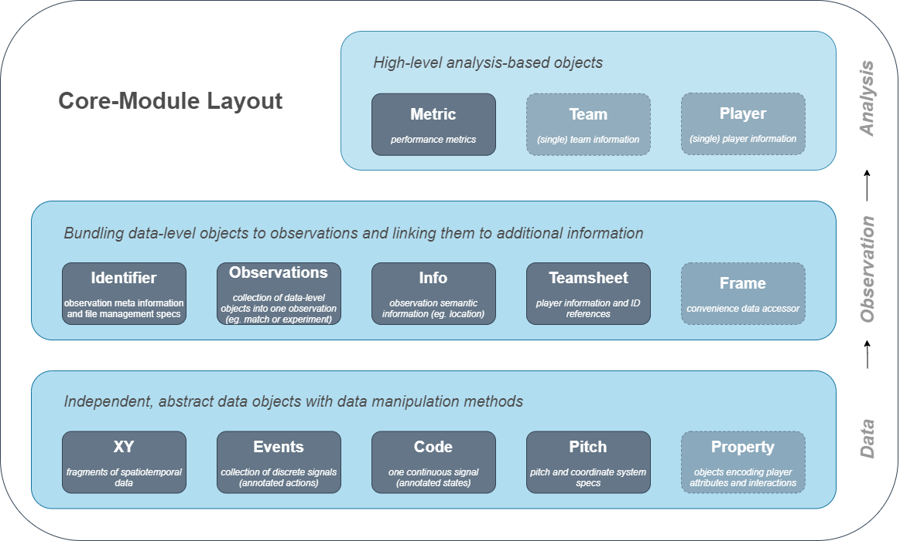

Match and performance data from all kinds of sports have seen a remarkable upsurge over the past decade. Better technology and professionalization have led clubs across countries and leagues to collect massive amounts of data and monitor almost every performance related aspect within their organization. However, working with sports data often involves numerous difficulties.

Researchers from the <a href="https://www.dshs-koeln.de/en/institut-fuer-trainingswissenschaft-und-sportinformatik/" style="color:black"><i>Institute of Exercise Training and Sports Informatics </i></a> have just released floodlight - an open source Python package for streamlined analysis of sports data. The package is built to meet the aforementioned difficulties such as provider-specific data formats, data type compatibility, or lack of standardized event-definitions. It is designed with a clear focus on scientific computing in order to make algorithms or validated models accessible and is built upon popular libraries such as numpy and pandas. 

The package aims to provide a high-level framework for team sports and runs completely provider- and sports-independent, while maintaining a maximum of flexibility to incorporate as many data types as possible. Floodlight enables to load, integrate, and process tracking and event data, codes and other match-related information from major data providers. In order to do that, the package offers a set of standardized data objects to structure and handle sports data, together with a suite of common processing operations such as transforms or data manipulation methods. The core data structures are organized as shown in this figure:
 
{: .mx-auto.d-block :}

In a nutshell, floodlight offers a set of streamlined data structures and standard functionality to make working with sports data more comfortable. "With the high-level interface the package creates a common ground for sports data analysis and incorporates numerous standard routines, allowing to put more focus on the actual analysis" says <a href="https://fis.dshs-koeln.de/portal/de/persons/dominik-raabe(748f8fdf-7c1b-40dd-8285-dc4826100e40).html" style="color:black"><i>Dominik Raabe</i></a>, project initiator and PhD student at the <a href="https://www.dshs-koeln.de/en/institut-fuer-trainingswissenschaft-und-sportinformatik/" style="color:black"><i>ITS</i></a>. 

The project is still in an initial phase but will expand the set of features in the future. At this point, core data structures and parsing functionality for major data providers have been implemented. "We are very pleased to have reached this first milestone and now plan to add the most important analysis methods used in research step by step to the framework" emphasizes <a href="https://fis.dshs-koeln.de/portal/de/persons/dominik-raabe(748f8fdf-7c1b-40dd-8285-dc4826100e40).html" style="color:black"><i>Dominik Raabe</i></a>.

The package is distributed under the MIT License and can be found on <a href="https://github.com/floodlight-sports/floodlight" style="color:black"><i>GitHub</i></a>. A detailed <a href="https://floodlight.readthedocs.io/en/latest/" style="color:black"><i>official documentation</i></a> provides a full package reference as well as background reads for a quick and easy start to using the package. There you will also find all relevant information on <a href="https://floodlight.readthedocs.io/en/latest/guides/getting_started.html#installation" style="color:black"><i>installation</i></a> and use, as well as a description of the general structure of the framework. Contributions are welcome!